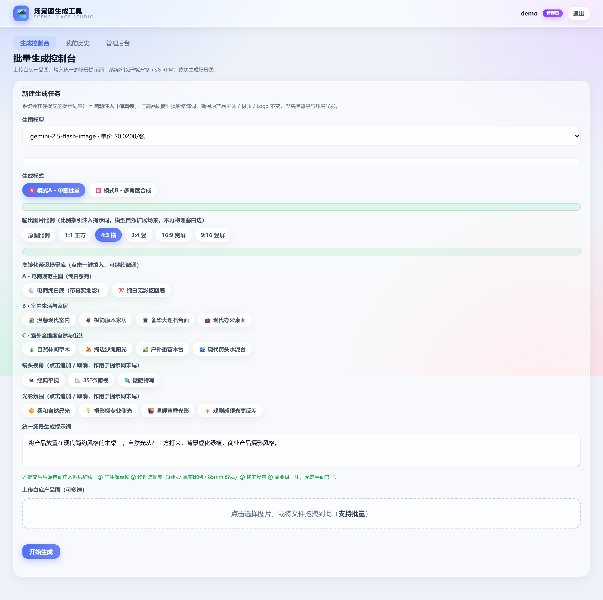
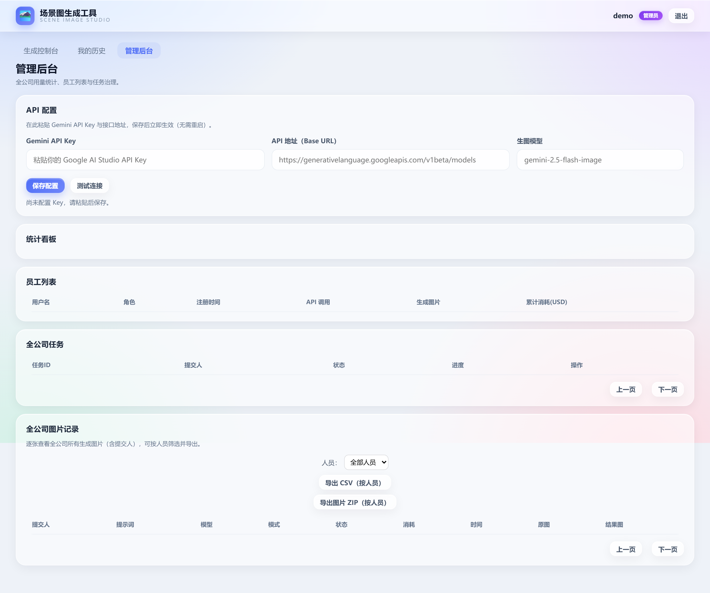
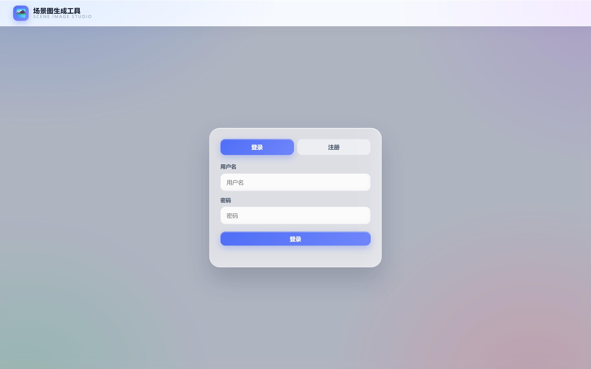

<div align="center">

# batch-product-studio · 批量产品场景图生成器

**白底产品图 → 电商场景图，一键批量生成 · Powered by Google Gemini API**

[](https://fastapi.tiangolo.com)
[](https://www.python.org)
[](https://ai.google.dev)
[](https://www.docker.com)
[](https://www.sqlite.org)
[](https://jwt.io)

[English](#english) · [快速部署](#-快速部署) · [界面截图](#-界面截图) · [核心特性](#-核心特性) · [API](#-api-速览)

</div>

---

## 这是什么？

**batch-product-studio** 是一个面向电商运营 / 跨境卖家 / 产品摄影团队的**批量产品场景图生成服务**：
上传一批白底产品图 → 输入统一场景描述 → 后端调用 **Google Gemini（`gemini-2.5-flash-image` / Imagen 3）**
依次生成高质量电商场景图，**自动限流、失败重试、进度可视、结果可下载**。

> 核心价值：把"一张张手动去 PS / Midjourney 替换背景"的工作，压缩成"丢进去、等几分钟、下载 ZIP"。

**关键词**：`batch product image generation` · `AI scene image generator` · `Gemini image API` · `白底产品图换背景` · `电商场景图批量生成` · `FastAPI` · `e-commerce product photography`

---

## 🚀 快速部署

### 方式一：Docker Compose（推荐）

```bash
# 1) 准备配置（必须）
cp .env.example .env
# 编辑 .env，填入：GEMINI_API_KEY=<你的 Google AI Studio Key>  与  JWT_SECRET_KEY=<强随机字符串>

# 2) 一键启动
docker compose up -d --build

# 3) 打开浏览器
#    http://localhost:7021
#    第一个注册的账号自动成为管理员
```

### 方式二：本地开发

```bash
python -m venv .venv && source .venv/bin/activate   # Windows: .venv\Scripts\activate
pip install -r requirements.txt
cp .env.example .env
uvicorn main:app --host 0.0.0.0 --port 7021 --workers 1
```

> ⚠️ **`--workers 1` 必须**：任务队列在进程内存中，SQLite 共享但队列不共享。
> 交互式 API 文档：<http://localhost:7021/docs>

---

## 📸 界面截图

### 控制台 — 批量生成主界面



> 一屏完成：**选模型 → 选模式 / 比例 → 选场景预设 / 镜头 / 光影 → 写统一提示词 → 拖入多张白底图 → 开始生成**。
> 场景预设库内置 12+ 个电商常用场景（极简白底 / 温暖现代室内 / 自然林间原木 / 户外露营木台 …）和 4 种光影氛围，点击即填入提示词。

### 管理后台 — 用量统计与 API 配置



> **API 配置**（Key / Base URL / 模型）可视化保存，无需重启即生效，支持「测试连接」一键校验。
> **统计看板**实时显示全公司员工数、总调用、总生成图、按模型与按人消耗的 USD / 人民币成本；任务与图片可按人筛选、批量导出 CSV / ZIP。

### 登录



---

## ✨ 核心特性

### 🎯 批量场景图生成（核心）

- **多模型支持**：默认 `gemini-2.5-flash-image`（图生图，保留产品主体），可切换 `imagen-3.0-generate-002`（纯生图，质感更佳）。
- **双模式**：
  - **模式 A · 单图批量**：每张白底图独立生成一张场景图，**逐张精细控图**。
  - **模式 B · 多角度合成**：同一张白底图一次性输出多个机位 / 角度 / 比例变体。
- **6 种比例**：1:1 / 4:3 / 3:4 / 16:9 / 9:16 / 原图比例 —— 选择后**自动以英文 composition 指引注入提示词**，由模型在生成时自然扩展场景以匹配比例（不再物理塞白边，效果更自然）。
- **场景预设库**：12+ 个电商常用场景（白底抠图 / 现代室内 / 极简原木 / 奢华大理石 / 户外绿植 / 街拍 …）和 4 种光影氛围（柔和晨光 / 专业棚侧光 / 高级冷调 / 自然背光），**一键填入提示词**，可继续微调。
- **任务队列**：上传 N 张图 → 写入 `asyncio.Queue` → Worker 串行消费，进度条 + 实时状态轮询。

### 🛡 防 429 限流（为生产环境设计）

- **全局信号量 `Semaphore(1)`**：同一时刻最多 1 个生图请求在飞。
- **强制节流**：每次成功生图后 `asyncio.sleep(3.5s)`，实测 ~17/min，**远低于 10 RPM** 免费上限。
- **指数退避重试**：捕获 HTTP `429` / `5xx` / 网络错误 → 按 `5/10/20s` 退避重试 **最多 3 次**；耗尽则单图标记 `failed`，**不阻塞队列其他图**。
- **HTTP 代理友好**：`httpx` 自动读取 `HTTP_PROXY` / `HTTPS_PROXY`，容器内对 Google API 的调用可直接走代理。

### 🔒 保真锁（后端强制，保证产品主体不变形）

后端在把提示词发给 Gemini **之前**自动包裹两层（见 `app/prompts.py`）：

1. **保真约束前置**：严格保留原产品主体 / 形状 / 材质 / Logo / 纹理，**仅替换背景与环境光影**。
2. **高品质商业摄影修饰词后置**：`ultra-detailed, photorealistic, 8k commercial photography, realistic contact shadows`。
   → 员工无论怎么写提示词，都不会破坏主体一致性。

### 👥 多用户 + 管理员后台

- **JWT 鉴权**：首个注册账号自动成为 `admin`，其余为 `staff`。
- **API Key 在线配置（推荐）**：管理员后台 → 「API 配置」卡片 → 粘贴 Key / 改 Base URL / 换模型 → 「保存配置」**立即生效**，无需重启；「测试连接」会用 `models.list` 接口校验 Key 是否有效（**不消耗生图额度**）。配置存于 `data/settings.json`，**优先级高于 `.env`**。
- **用量统计**：每个成功生图请求**原子递增**该用户的 `total_api_calls` / `total_images_generated`；后台按模型 / 按人展示累计消耗（USD + CNY 实时换算）。
- **任务治理**：管理员可查看 / 强制删除全公司任意任务与图片，按提交人筛选并导出。

### 💾 持久化与重启恢复

- **SQLite + SQLModel**：`User` / `GenerationTask` / `TaskItem` 三张表，应用启动自动建表。
- **重启自动恢复**：`worker.recover_pending()` 扫描 `pending/processing` 的 Item 重新入队 —— **DB 是唯一可信源**，进程崩溃 / `docker compose restart` 后任务不丢。
- **数据落盘**：`./data/app.db` 与 `./storage/{uploads,outputs}` 通过 Bind Mount 挂载到容器，**只要不删宿主机目录，数据永久保留**。

### 🗂 文件生命周期

- `DELETE /api/items/{id}`：物理删除磁盘文件 + 同步删除 DB 记录（员工本人或 admin）。
- `DELETE /api/tasks/{id}`：级联删除该任务下所有图片与文件。
- `GET /api/tasks/{task_id}/download-zip`：一键打包该任务所有结果图。

### 🎨 前端（Liquid Glass 设计系统）

- 顶栏 / 卡片 / 弹窗全部采用 `backdrop-filter` 液态玻璃 + 四角柔光渐变背景。
- 单页 SPA：登录 / 注册弹窗、批量生成控制台、个人历史（分页 / 删除）、管理员专属统计后台 Tab。
- 移动端响应式适配（≤768px 自动调整内边距与字号）。

---

## ⚙️ 环境变量（.env）

| 变量 | 说明 | 默认 |
| --- | --- | --- |
| `GEMINI_API_KEY` | Google AI Studio Key | **必填** |
| `GEMINI_MODEL` | 后台默认生图模型 | `gemini-2.5-flash-image` |
| `REQUEST_INTERVAL_SECONDS` | 成功调用后强制间隔（秒） | `3.5` |
| `SEMAPHORE_CONCURRENCY` | 并发通道（保持 1） | `1` |
| `MAX_RETRIES` | 429/5xx 最大重试 | `3` |
| `RETRY_BACKOFF_SECONDS` | 退避等待（逗号分隔） | `5,10,20` |
| `JWT_SECRET_KEY` | JWT 签名密钥（**请改为强随机**） | 占位 |
| `JWT_ALGORITHM` | JWT 算法 | `HS256` |
| `ACCESS_TOKEN_EXPIRE_MINUTES` | Token 有效期 | `1440` |
| `STORAGE_DIR` / `UPLOADS_DIR` / `OUTPUTS_DIR` / `SQLITE_PATH` | 存储路径 | 见 `.env.example` |
| `HTTP_PROXY` / `HTTPS_PROXY` | 可选代理（国内访问 Google） | 空 |

> 💡 **关于 `gemini-2.5-flash-image` 的额度**：该模型已从免费档移除，**免费额度为 0**。Key 鉴权有效 ≠ 能生图 —— 未给该 Key 所属 Google 账号**开通计费（绑定付费方案）**前，所有生图请求会返回 `429 Quota exceeded (limit: 0)`。**这是账号额度问题，不是代码问题。** 失败任务会在 item 的报错里显示 Google 原文与中文提示，便于排查。开通计费后按张计费。

---

## 📡 API 速览

| 方法 | 路径 | 权限 | 说明 |
| --- | --- | --- | --- |
| `POST` | `/api/auth/register` | 公开 | 首个用户 = admin |
| `POST` | `/api/auth/login` | 公开 | 返回 JWT |
| `GET`  | `/api/auth/me` | 登录 | 当前用户信息 |
| `GET`  | `/api/config` | 公开 | 后台默认模型 + 模型目录 |
| `POST` | `/api/tasks/create` | 登录 | 创建批量任务（支持 `model` 覆盖） |
| `GET`  | `/api/tasks/{task_id}` | 本人/admin | 任务详情 + 全部 item |
| `GET`  | `/api/tasks/my-history` | 登录 | 我的历史（分页） |
| `GET`  | `/api/tasks/{task_id}/download-zip` | 本人/admin | 一键打包下载 |
| `DELETE` | `/api/items/{item_id}` | 本人/admin | 物理删除单图 |
| `DELETE` | `/api/tasks/{task_id}` | 本人/admin | 删除整任务 |
| `GET`  | `/api/admin/dashboard/stats` | admin | 统计看板 |
| `GET`  | `/api/admin/users` | admin | 员工列表 |
| `GET`  | `/api/admin/tasks/all` | admin | 全公司任务（分页） |
| `GET/PUT` | `/api/admin/settings` | admin | API Key / Base / 模型在线配置 |
| `POST` | `/api/admin/settings/test` | admin | 测试连接（不消耗额度） |

完整 OpenAPI 文档：启动后访问 `/docs`。

---

## 🏗 设计要点

1. **限流发生在全局 Worker**：无论多少任务并发提交，同一时刻仅 1 个生图请求在飞，且两次成功请求间隔 ≥ 3.5s —— 这是稳定的 `<10 RPM`，**完美绕开 Gemini 免费档的 429 雷区**。
2. **单图失败不阻塞**：队列继续消费，失败信息写入 `error_message`，管理员后台可见。
3. **计数器原子性**：成功生图时在同一 DB 事务内递增 `User.total_api_calls` 与 `total_images_generated`，保证统计准确。
4. **重启恢复**：`worker.recover_pending()` 启动时扫描 `pending/processing` 的 Item 重新入队，**DB 为唯一可信源**。
5. **删除即清理**：`DELETE` 接口会物理删除 `storage/` 下对应文件并清理空目录，**不留垃圾**。
6. **保真锁（后端强制）**：`worker._process` 在调用 `generate_image` 前用 `assemble_prompt(task.prompt)` 包裹，**员工无法绕过**。
7. **配置优先级**：`data/settings.json`（管理员后台保存） > `.env`（启动时读取）。热更新无需重启。

---

## 🧱 技术栈

- **后端**：FastAPI · SQLModel · SQLite (async) · httpx · python-jose · passlib
- **生图**：Google Gemini API（`gemini-2.5-flash-image` / Imagen 3）
- **前端**：原生 HTML + CSS（Liquid Glass 设计系统，无框架依赖）
- **部署**：Docker · docker-compose · Bind Mount 持久化

---

## 🛠 常见问题

<details>
<summary><b>启动后数据"消失"了？</b></summary>

99% 是下面两种情况之一：

1. **同时跑了两个实例抢同一个 7021 端口**（比如 Docker 跑着一个、宿主机又 `uvicorn` 跑着一个），连到错的实例就会以为数据没了。**务必只跑一个。**
2. **用了 `docker run` 没挂卷**，数据库写在容器可写层，容器重建即清空。**始终用本仓库的 `docker-compose.yml`（已含 `./data` 挂载）。**

验证持久化：注册账号 → `docker compose restart` → 重新登录应仍可用。
</details>

<details>
<summary><b>Key 没错但生成一直 429？</b></summary>

这是 Gemini 的额度问题，不是代码或地址问题。`gemini-2.5-flash-image` 已从免费档移除，**免费额度为 0**。需要在 Google AI Studio 给该 Key 所属账号**开通计费**（绑定付费方案）才能生图。Key 鉴权有效（能列模型）≠ 能生图。
</details>

<details>
<summary><b>国内访问 Google API 慢/失败？</b></summary>

`.env` 中设置 `HTTP_PROXY` / `HTTPS_PROXY=http://your-proxy:port` 即可，`httpx` 会自动走代理。
</details>

---

## English

**batch-product-studio** — a self-hosted **batch product scene image generator** powered by **Google Gemini API**.
Upload many white-background product photos, write one unified scene prompt, and the service calls
`gemini-2.5-flash-image` (or Imagen 3) to produce e-commerce-ready scene images **one by one with strict rate limiting
(≤17 req/min, well under Gemini's 10 RPM free quota)** to avoid `429 Quota exceeded`.

Features:
- **Anti-429 rate limiting**: global `Semaphore(1)` + 3.5s post-success sleep + exponential backoff (`5/10/20s` × 3).
- **Fidelity Lock**: backend auto-wraps every prompt with subject-preservation constraints + commercial photography modifiers — staff prompts **cannot** distort the product.
- **Multi-user + admin**: JWT, first registrant is admin; live API-key config (no restart), per-user & per-model cost tracking (USD/CNY).
- **Crash recovery**: SQLite is the source of truth; `worker.recover_pending()` re-queues in-flight items on restart.
- **12+ scene presets** (clean white / warm interior / outdoor wood / marble / street …) + 4 lighting moods, one-click to fill prompt.
- **6 aspect ratios** (1:1 / 4:3 / 3:4 / 16:9 / 9:16 / original) — ratio is injected as a *composition hint* into the prompt, letting the model naturally extend the scene instead of letterboxing.
- **Two modes**: A) one scene per input; B) multi-angle / multi-ratio variants of a single input.
- **Docker one-liner** + Bind-Mount persistence.

Stack: FastAPI · SQLModel · SQLite · httpx · vanilla HTML/CSS (Liquid Glass UI).

---

## 📄 License

MIT — see [LICENSE](LICENSE) (如果你要换成其它协议，把这里的链接换掉即可)。
